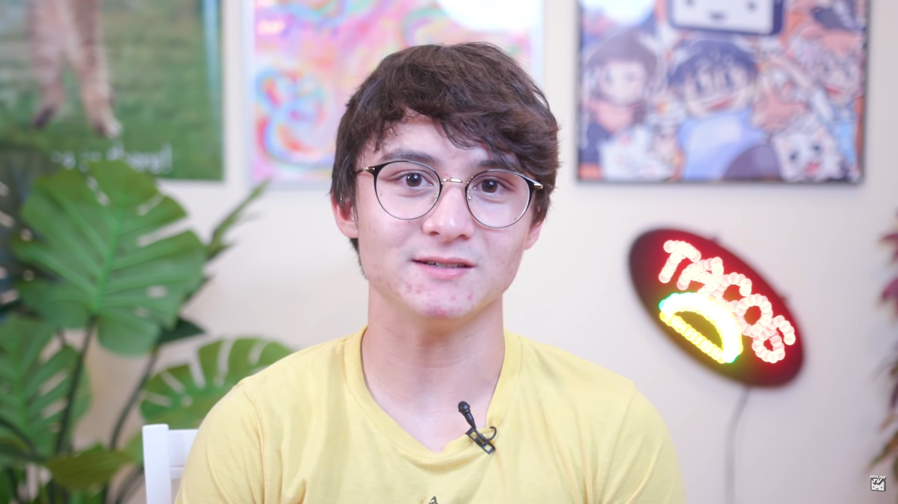
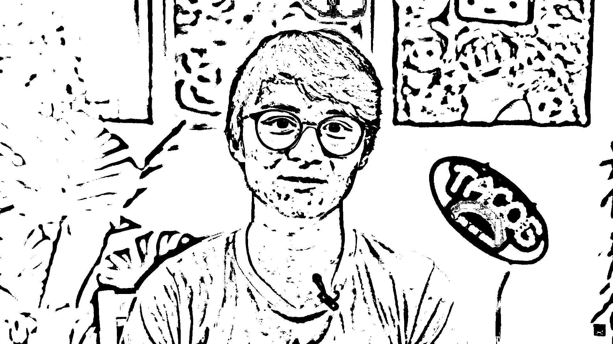
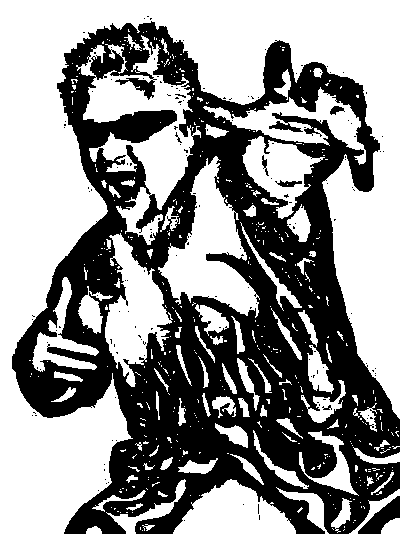

# Take On Me Sketchifier

**Written only using 130 lines of code, this software allows you to turn any image or live webcam feed into a sketched version similar to style shown in Aha's Take On Me Music video.**

**Using Object Oriented Programming, my ImageSketcher object sketches any image into a version that looks draw. And by "Sketching" I mean passing through many filters.**

**Features:**
* Sketching any image file and then resizing that image file
* Sketching a live webcam
* Sketcher Object which can be implemented and changed for various use cases (ex. for a video file)

**Examples:**

*Before:*

*After:*

*Before:*

*After:*

