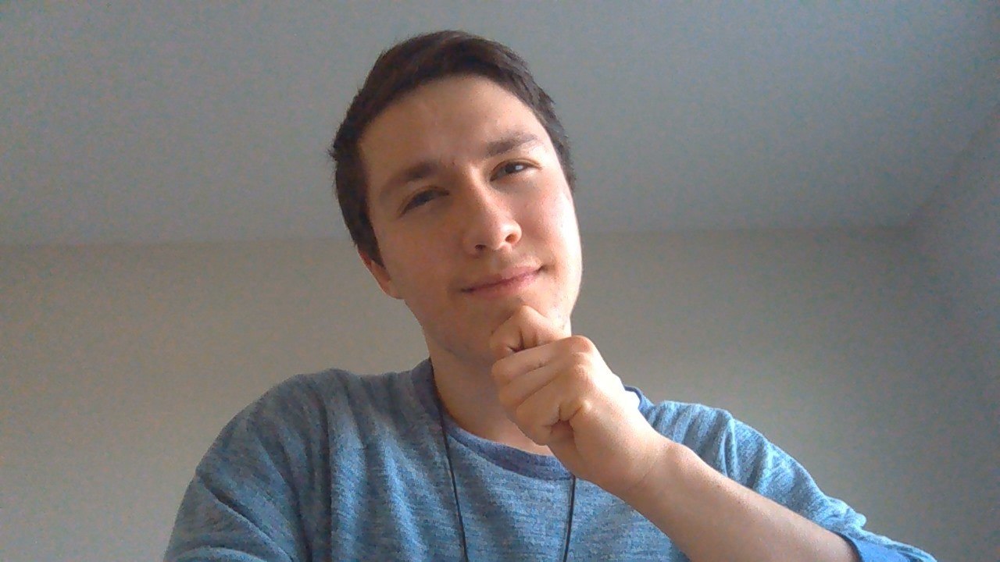
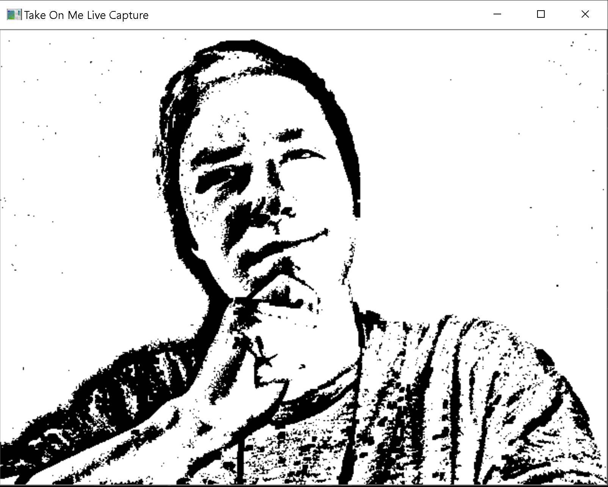

# Take On Me Sketchifier

An ImageSketcher object is one that sketches any image into a version that looks draw. And by "Sketching" I mean passing through many filters. The resulting image is one that highlights the outlines of an image to appear like it's inked

**Features:**
* Sketching any image file and then resizing that image file
* Sketching a live webcam
* Sketcher Object which can be implemented and changed for various use cases (ex. for a video file)

**Further Development:**
* Deal with sketching low resolution images/video feeds
* Use a style-transfer GAN Neural Network

**Examples:**

*Before*

*After:*

*Before:*

*After:*

*Before:*

*After:*

